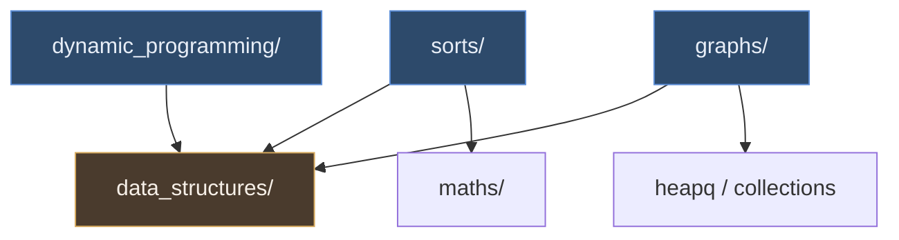

# 官方源码模块依赖图（TheAlgorithms/Python）

> 这一步属于方法论里的「**读**」：clone 官方仓库 → 精读核心模块 → 画出依赖关系。
> 下面先给一份官方仓库的顶层结构地图；**依赖图待你读完源码后补充**。

## 官方仓库顶层结构（只列与本项目相关的部分）

```
TheAlgorithms/Python/
├── sorts/                     # 排序：bubble_sort, quick_sort, merge_sort, heap_sort, ...
├── dynamic_programming/       # 动态规划：knapsack, lcs, edit_distance, coin_change, ...
├── graphs/                    # 图论：bfs, dfs, dijkstra, bellman_ford, topological_sort, ...
├── data_structures/           # 数据结构：栈/队列/堆/并查集 —— 上面三类的地基
├── searches/                  # 查找：binary_search, linear_search, ...
├── maths/                     # 数学
├── strings/                   # 字符串
├── tests/                     # 官方测试（doctest 为主）
└── README.md                  # 分类索引
```

## 关键观察（读源码时验证）

1. **无统一抽象层**：官方把每个算法写成独立文件 + 模块级函数，不做基类/接口。
   - 好处：单文件可独立运行、便于贡献。
   - 代价：命名与签名不统一（有的返回新列表，有的原地排序）。
2. **测试靠 doctest**：函数 docstring 里的 `>>>` 既是文档也是测试。
   - 复刻时我改用 pytest——更严格的类型/边界覆盖，便于统计覆盖率。
3. **`data_structures/` 是三类算法的公共依赖**：堆排序依赖 heap，BFS/DFS 依赖 queue/stack，
   DP 的滚动数组本质是数组复用。

## 模块依赖图（待填）

> 读完官方源码后，把下面这张骨架换成真实依赖关系（可直接改 mermaid 源码）。



**待补充**：
- [ ] `sorts/heap_sort.py` 与 `data_structures/heap/` 的调用关系
- [ ] `graphs/dijkstra*.py` 各变体之间是否有复用
- [ ] 哪些模块反过来被 `maths/` 依赖（找循环依赖）
