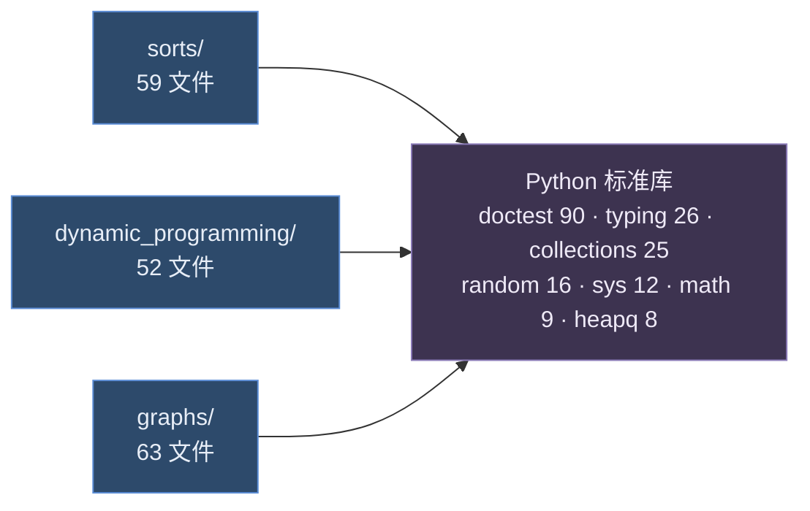
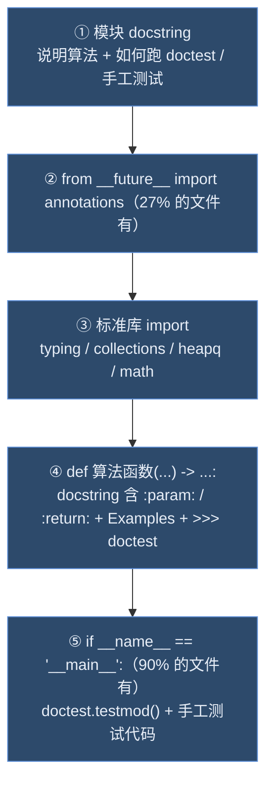

# 官方源码模块依赖图（TheAlgorithms/Python）

> 方法论第①步「读」的产出：clone 官方仓库 → 精读核心模块 → 画出依赖关系。
>
> **状态：已实测完成**（2026-09-18）。下面所有结论都来自对官方仓库的**全量静态分析**
> （177 个文件的 AST 级 import 提取）加人工精读，不是推测。
> 本地参考仓：`D:\workbody\github\_reference\TheAlgorithms-Python`（浅克隆，16 MB）。

---

## 一、官方仓库是什么形态

结论先说：**它不是 Python 库，而是一个"按主题分类的算法标本集"**。

- 49 个顶层目录、1539 个 `.py` 文件、16 MB
- 目录名就是分类：`sorts/`、`graphs/`、`dynamic_programming/`、`maths/`、`ciphers/`、`physics/` …
- 没有包级导出、没有统一 API、没有对外安装入口
- `pyproject.toml` 只承担 lint / 测试 / 依赖清单职责，**不作为包发布**

这一点决定了「复刻」的正确姿势：**不是照搬它的架构，而是对齐它的编写规范**。

---

## 二、三个目标目录的规模

| 官方目录 | 算法文件数 | 本项目的对应目录 |
|---|---|---|
| `sorts/` | 59 | `src/myalgo/sorting/` |
| `dynamic_programming/` | 52 | `src/myalgo/dynamic_programming/` |
| `graphs/` | 63（另有 `tests/` 下 4 个 unittest 文件） | `src/myalgo/graph/` |

命名差异：官方用复数 `sorts` / `graphs`，本项目用 `sorting` / `graph`。
文件名风格两边一致——全小写 + 下划线（snake_case，CONTRIBUTING 硬性要求）。

---

## 三、依赖图（实测）

### 3.1 核心发现：三个目录之间零依赖

对三个目录全部 **177 个文件**做 AST 级 import 提取，结果是：

> **`sorts/` ↔ `dynamic_programming/` ↔ `graphs/` 之间没有任何一条 import。**
>
> 整个仓库内跨模块引用只出现 1 处：`sorts/benchmark_sorts.py` —— 它是性能基准脚本，
> 用 `from sorts.xxx import yyy` 显式引入同目录的 11 个排序实现来对比耗时。

也就是说，官方把每个算法都写成**完全自足的孤岛**：复制单个文件出去，它照样能跑。

**验证证据**（这两个是设计上最容易产生跨目录依赖的地方，实测都没有）：

| 文件 | 直觉上应该依赖 | 实际做法 |
|---|---|---|
| `sorts/heap_sort.py` | `data_structures/heap/` | 自己用列表 + 索引运算实现 `heapify`，零外部引用 |
| `graphs/dijkstra.py` | 仓库内的堆实现 | 直接用标准库 `heapq.heappush/heappop` |

### 3.2 真实依赖图

所有依赖箭头最终都指向 **Python 标准库**，目录之间没有横向连线：

### 3.3 单个算法文件的标准骨架

官方 90% 的文件严格遵循同一套骨架，这是最值得「对齐」的东西：

第三方的使用极其克制，全三个目录只有 5 个非标准库依赖：

| 库 | 出现次数 | 用在哪 |
|---|---|---|
| `numpy` | 5 | 矩阵类算法 |
| `timeit` | 4 | 基准脚本 |
| `pprint` | 3 | 调试输出 |
| `unittest` | 2 | `graphs/tests/` 下的显式测试 |
| `tensorflow` | 1 | `k_means_clustering_tensorflow.py` |

这和 CONTRIBUTING 的要求一致：*"Avoid importing external libraries for basic algorithms."*

---

## 四、代码风格规范（CONTRIBUTING 原文 + 实测符合率）

| 项 | 官方要求 | 实测（177 文件） | 本项目怎么做 |
|---|---|---|---|
| 模块 docstring | 说明算法 + 跑 doctest 的命令 | 几乎 100% | ✅ 照做 |
| doctest | "highly encourage doctests on **all** functions" | **88%** | ✅ 保留 doctest |
| `__main__` 块 | 未强制 | 90% | ⚠️ 只在对拍/演示脚本里加 |
| 类型注解 | 鼓励，CI 跑 `ty`（不卡合并） | 参数/返回值基本齐全 | ✅ 全部标注 |
| 复杂度标注 | **未要求** | 仅 14% | ✅ 本项目**强制要求**（学习目的） |
| 命名 | snake_case 文件/函数、CamelCase 类、**禁止单字母变量** | 基本遵守 | ✅ 照做 |
| 注释 | 解释 *why* 而非 *what*，放在被描述代码**之前**，同行注释不超 88 字符 | — | ✅ 照做 |
| 异常 | 对非法输入 `raise ValueError` | — | ✅ 照做 |
| 返回值 | "return all results instead of printing" | 有例外（见下） | ✅ 照做 |
| 格式化 | `ruff format` + `ruff check` **必须通过** | CI 强制 | 本地可选跑 ruff |
| Python 版本 | **3.14t（free-threaded）** | `requires-python = ">=3.14"` | ⚠️ 本项目用 **3.11** |
| 测试命令 | `pytest`（配置了 `--doctest-modules`） | — | `pytest` + `--doctest-modules` |

### 版本落差是真实存在的

官方已全面迁移到 Python 3.14，实测有 **15 个文件（8%）用了 PEP 695 泛型语法**
（如 `def heap_sort[T: Comparable](unsorted: list[T]) -> list[T]:`），
另有 2 个文件用了 **PEP 758**（`except A, B:` 可省括号）：

- `dynamic_programming/catalan_numbers.py:74`
- `dynamic_programming/egg_dropping.py:69`

这两个文件**连本机的 Python 3.13 都无法解析**。所以：

> **不要指望直接 `import` 官方代码来做对拍。** 对拍要对齐的是**算法语义**，
> 不是"调用官方源码"。

实测有一处官方自己违背了 CONTRIBUTING 的"零副作用"要求：
`graphs/dijkstra.py` 在模块顶层（第 107-114 行）直接调用了 `print()`，
**只要 import 它就会打印 3 行结果**。这是官方现存的小瑕疵。

---

## 五、本项目的对齐与取舍

| 维度 | 官方做法 | 本项目做法 | 为什么这样取舍 |
|---|---|---|---|
| Python 版本 | 3.14t | **3.11** | 本机 `py311` 环境；3.11 语法通用性更好，且不依赖 free-threading |
| 测试 | `pytest --doctest-modules`，以 doctest 为主 | **doctest + 独立 pytest 用例双轨** | 独立用例才能覆盖边界值 / 异常 / 随机对拍，也便于统计覆盖率 |
| 目录命名 | `sorts` / `graphs`（复数） | `sorting` / `graph`（单数） | 各自命名习惯，不影响功能对齐 |
| 复杂度标注 | 14% 覆盖，不作要求 | **强制每个函数都标** | 复刻目的是学，标注清楚才能内化 |
| 单文件自足 | 100% 遵守 | ✅ 同样遵守 | 实测证明这是官方可维护性的关键，值得照搬 |
| 依赖 | 几乎纯标准库 | 同样纯标准库（pytest 仅测试期） | 一致 |
| 基准对比 | `sorts/benchmark_sorts.py` + `timeit` | 后续照它做一个 `benchmark_sorting.py` | 实测 10 个排序的耗时对比，是很好的「证」的产出 |

---

## 六、对 M1 的四条指导

1. **保持单文件自足**：不要把 `quick_sort` 的结果喂给别的算法复用，每个文件独立可运行。
   实测官方 177 个文件里没有任何反例（除基准脚本），这条设计原则被验证是对的。
2. **doctest 不要丢**：它是官方第一公民（88% 覆盖）。做法是「docstring 里写 doctest 当文档，
   同时在 `tests/` 写独立用例管边界」，两者互补而不是二选一。
3. **对拍针对语义**：官方跑 3.14 + PEP 695/758 语法，本地 3.11 跑不了；
   随机对拍应该用「自己写的朴素实现」或「标准库 `sorted()`」当参照，
   而不是去 import 官方文件。
4. **完成后照 `benchmark_sorts.py` 写基准**：用 `timeit` 对比自己 10 个排序的耗时，
   这既是「证」的产出，也是简历上能展示的东西。

---

## 七、上次留的三个待填点 —— 已实测回答

- [x] `sorts/heap_sort.py` 与 `data_structures/heap/` 的调用关系？
      → **没有关系**。`heap_sort.py` 自己用列表索引实现 `heapify`，不引用 `data_structures/`。
- [x] `graphs/dijkstra*.py` 各变体之间是否有复用？
      → **没有复用**。`dijkstra.py`、`dijkstra_2.py`、`dijkstra_algorithm.py`、
      `dijkstra_alternate.py`、`dijkstra_binary_grid.py` 各自独立，互相不 import。
- [x] 哪些模块反过来被 `maths/` 依赖（找循环依赖）？
      → **不存在循环依赖**，因为三个目录连正向依赖都没有。跨模块引用全仓仅 1 处（基准脚本）。
